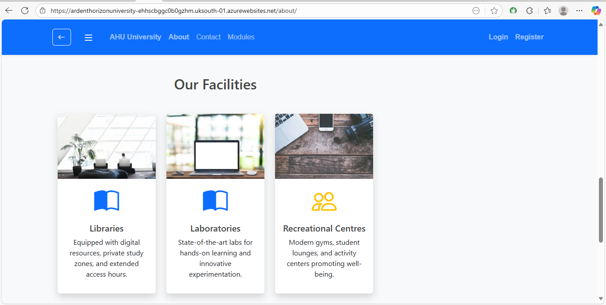
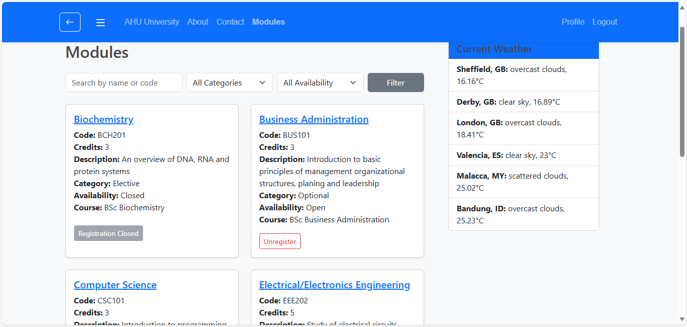
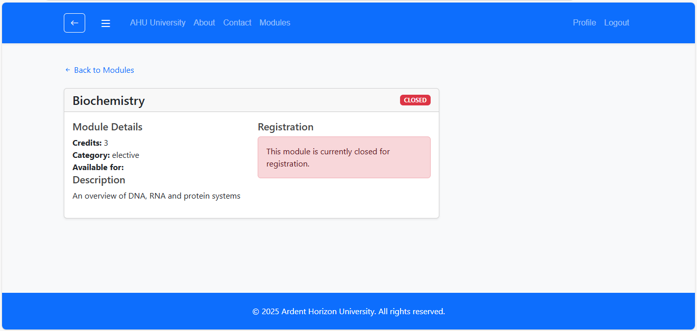

# 🎓 Ardent Horizon University (AHU) – Student Portal  

**Link:** https://ardenthorizonuniversity-ehhscbggc0b0gzhm.uksouth-01.azurewebsites.net/

**GitHub Repo:** https://github.com/Blessing1-dev/django-app.git  

---

## 📖 About the Project  
This project was developed as part of a group coursework at Sheffield Hallam University.  
The **Ardent Horizon University Student Portal** is a prototype web application that allows students to:  
- Register an account and manage their profiles  
- Browse and register for academic modules  
- View their registrations and manage enrolments  

The portal also includes administrative features to manage modules and student records.  

---

## 🚀 Key Features  
- 👩🏽‍🎓 **Student Registration & Login** – Create an account with a profile page  
- 📚 **Module Management** – View mandatory/optional modules  
- 📝 **Module Registration** – Students can register/unregister for modules  
- 🖼️ **Profile Display** – Student details (DOB, address, photo, etc.) displayed on profile page  
- 👥 **Group Management** – Each student linked to only one course group  
- 📅 **Registration Tracking** – Date/time of registration stored in the database  

---

## 🛠️ Technologies Used  
- **Backend:** Python 3, Django 5  
- **Frontend:** HTML, CSS, Bootstrap   
- **Database:** MySQL (via Azure), SQLite (local development)  
- **Cloud Hosting:** Azure DevTest Labs  
- **Version Control:** Git & GitHub (branches for each team member)  

---

## 👩🏽‍💻 My Role  
As part of a 4-member team, my main contributions were:  
- Setting up the Django project and base configuration  
- Implementing the **Student model** (profile linked to Django’s User model)  
- Building the **student profile page** and edit functionality  
- Integrating user authentication (login/logout, registration)  
- Managing the **main branch on GitHub** and merging feature branches    

---

## 📚 Learnings  
- Improved collaboration using **Git branching** and **pull requests**  
- Strengthened my skills in Django models, signals, and templates  
- Learned how to manage group roles and merge work into a main project  

---

## 🤝 Teamwork  
This project was developed collaboratively with 3 teammates.  
Each team member managed their own branch, and I oversaw integration into the **main branch**.  

---

## 📸 Screenshots  
**Homepage:**   
 

**Module registration:**

**Module details:**

---

## 🔗 Related Projects  
- Lily Beauty Bar – Personal Project: https://github.com/blessing267/lilybeautybar.git
- FarmMarket – MSc Dissertation Project: https://github.com/blessing267/repo.git  

