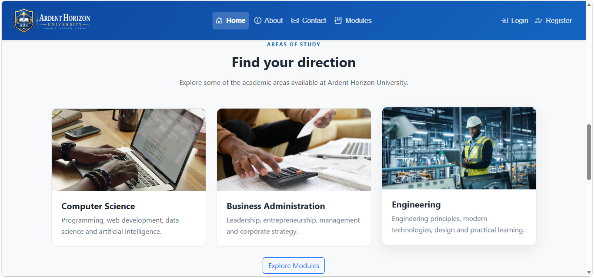
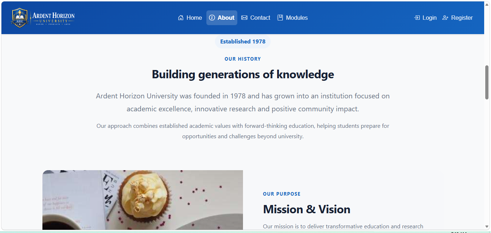
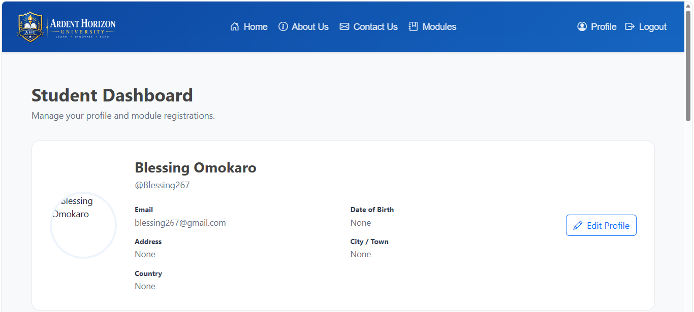
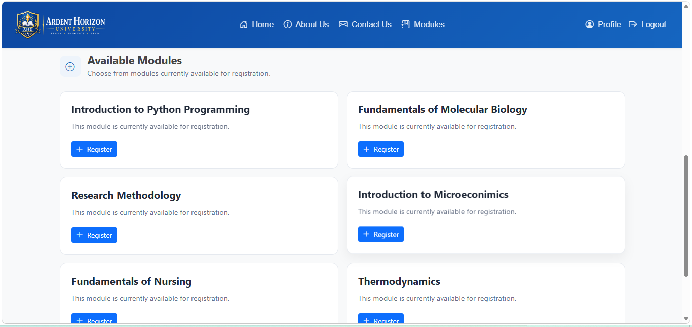
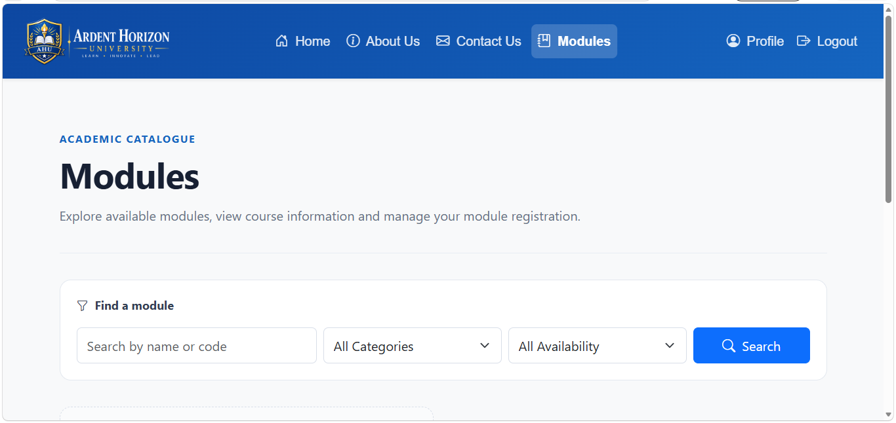

# 🎓 Ardent Horizon University (AHU) – Student Portal  

**Live:** https://ardenthorizonuniversity-fuangtatg6fma5ee.ukwest-01.azurewebsites.net/

**GitHub Repo:** https://github.com/blessing267/django-app.git  

---

## 📖 About the Project  
Ardent Horizon University is a role-based university management web application built with Django.

The platform supports different levels of access for students and staff, allowing students to manage their profiles, browse eligible academic modules, register and unregister from modules, while staff users can create, edit and delete module information.

The application also includes an IT issue-reporting system, REST API functionality, external weather API integration and cloud services through Microsoft Azure.

The project was developed to strengthen my experience in full-stack Django development, role-based access control, REST APIs, relational databases, third-party API integration, cloud storage and automated cloud deployment.  

---

## 🛠️ Technologies Used  
- **Backend:** Python, Django
- **API:** Django REST Framework
- **Frontend:** HTML, CSS, Bootstrap, Django Templates
- **Database:** MySQL
- **Authentication:** Django Authentication
- **External API:** OpenWeather API
- **Cloud Platform:** Microsoft Azure
- **Hosting:** Azure App Service
- **Cloud Storage:** Azure Blob Storage
- **Serverless Integration:** Azure Functions
- **CI/CD:** GitHub Actions
- **Version Control:** Git & GitHub  

---

## 📸 Screenshots  
**Homepage:**   
 

**About page:**   

**Profile page:**   

**Modules Regsitration:**

**Module Page:**
 

**Modules:**

**Module details:**

---

## 🚀 Key Features  
- 👥 **Role-Based Access** – Different functionality is provided to students and staff based on authentication, staff status and user groups.
- 🎓 **Student Registration & Profiles** – Students can create accounts and maintain profile information including profile images and personal details.
- 📚 **Module Management** – Academic modules include module codes, credits, descriptions, categories and availability status.
- 📝 **Module Registration** – Students can register and unregister from available modules while duplicate registrations are prevented.
- 🎯 **Course-Based Module Access** – Modules can be associated with user groups so students only see modules relevant to their assigned course/group.
- 🔎 **Module Search & Filtering** – Modules can be searched by name or code and filtered by category and availability.
- 👩‍💼 **Staff Module Administration** – Staff users can create, edit and delete academic modules.
- 🛠️ **IT Issue Reporting** – Authenticated users can report hardware and software issues, specify locations and urgency, and manage their own reports.
- 🔐 **Protected Issue Management** – Users can update or delete only the IT issues they submitted.
- 🔌 **REST API** – Django REST Framework exposes IT issue data through API endpoints with authentication and permission controls.
- 🌤️ **Weather API Integration** – The homepage retrieves live weather information for multiple locations using the OpenWeather API.
- ☁️ **Azure Integration** – The application integrates Microsoft Azure services including Azure App Service, Azure Storage and an Azure Function.
- 🚀 **Automated Deployment** – GitHub Actions provides a build-and-deployment workflow for deployment to Azure App Service.
- 📱 **Responsive Interface** – The user interface is built with Bootstrap for use across different screen sizes.  

---

## ☁️ Cloud & Deployment

The application was configured and deployed using Microsoft Azure.

Cloud functionality includes:

- Azure App Service for hosting the Django application.
- Azure Blob Storage for application media/files.
- Azure Functions integration triggered during module-registration workflows.
- MySQL database configuration through environment variables.
- Environment-based production configuration.
- GitHub Actions CI/CD workflow for automated Azure deployment.

---

## 🔗 Related Projects  
- Lily Beauty Bar: https://github.com/blessing267/lilybeautybar.git
- FarmMarket Web App: https://github.com/blessing267/repo.git  
- Dessert Affairs: https://github.com/blessing267/dessert-affairs.git
